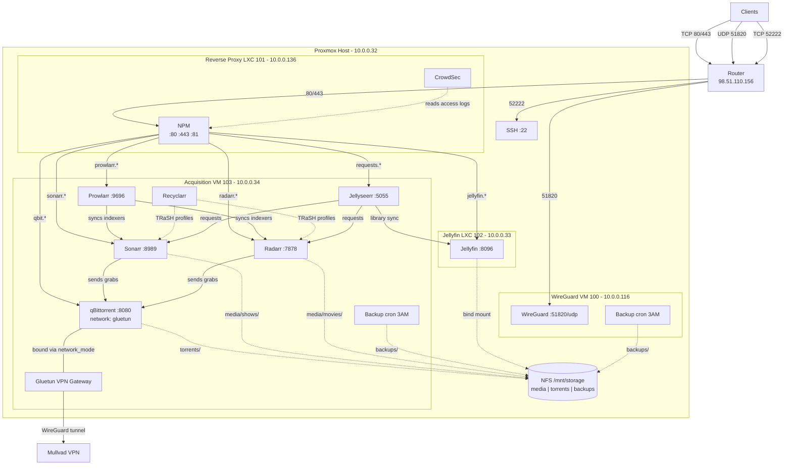

# Farallon Home Lab — Operations Guide

## Architecture



### Design Principles

- **Everything is cattle.** All VMs and LXCs can be destroyed and recreated
  with `tofu destroy` + `tofu apply`. No `prevent_destroy` anywhere.
- **One stateful thing:** `/mnt/storage` on the Proxmox host. Terraform does
  not manage it. Media, backups, and torrents live here.
- **Config on local disk, backed up to NFS.** SQLite databases stay on each
  VM's local disk (NFS is unsafe for SQLite — broken file locking and WAL mode
  incompatibility). Daily cron backs up config to NFS. Terraform auto-restores
  on redeploy.

### Network Map

| Resource           | Type | IP           | Ports                    |
|--------------------|------|--------------|--------------------------|
| Proxmox host       | —    | 10.0.0.32    | 8006 (API), 22 (SSH)     |
| WireGuard          | VM   | 10.0.0.116   | 51820/udp                |
| Reverse Proxy      | LXC  | 10.0.0.136   | 80, 443, 81 (NPM admin) |
| Jellyfin           | LXC  | 10.0.0.33    | 8096                     |
| Acquisition        | VM   | 10.0.0.34    | 8989, 7878, 9696, 8080, 5055 |

Public IP: 98.51.110.156
Router port-forwards: TCP 80+443 to 10.0.0.136, UDP 51820 to 10.0.0.116, TCP 52222 to 10.0.0.32:22

### Services

| Service      | Container        | Purpose                                      |
|--------------|------------------|----------------------------------------------|
| Gluetun      | gluetun          | VPN gateway (Mullvad WireGuard). All torrent traffic exits through this. |
| qBittorrent  | qbittorrent      | Torrent client, network-bound to Gluetun (kill switch). |
| Prowlarr     | prowlarr         | Indexer manager. Syncs trackers to Sonarr/Radarr. |
| Sonarr       | sonarr           | TV show manager. Monitors, grabs, renames.   |
| Radarr       | radarr           | Movie manager. Same as Sonarr but for movies.|
| Jellyseerr    | jellyseerr        | Request portal for friends/family.            |
| Recyclarr    | recyclarr        | Syncs TRaSH Guide quality profiles to Sonarr/Radarr daily. |
| NPM          | npm              | Nginx Proxy Manager. SSL termination, subdomain routing. Admin created via `INITIAL_ADMIN_*` env vars from `.env` file. |
| CrowdSec     | crowdsec         | Reads NPM access logs, blocks malicious IPs. |
| Jellyfin     | (native in LXC)  | Media server with GPU transcoding.           |
| WireGuard    | wireguard        | Personal VPN for remote access into the LAN. |

### Proxy Hosts (NPM)

| Subdomain                      | Backend              |
|--------------------------------|----------------------|
| jellyfin.alexanderwest.com     | 10.0.0.33:8096       |
| requests.alexanderwest.com     | 10.0.0.34:5055       |
| sonarr.alexanderwest.com       | 10.0.0.34:8989       |
| radarr.alexanderwest.com       | 10.0.0.34:7878       |
| prowlarr.alexanderwest.com     | 10.0.0.34:9696       |
| qbit.alexanderwest.com         | 10.0.0.34:8080       |

---

## Data Persistence

### Bind Mounts (not Docker named volumes)

App config lives at `/opt/<stack>/appdata/<service>/` on each VM's local disk.
Using bind mounts instead of Docker named volumes means `docker compose down -v`
won't wipe config.

### Backup/Restore

Both the acquisition VM and WireGuard VM have daily backup cron jobs that tar
their config to `/mnt/storage/backups/` on the NFS share. Terraform provisioners
auto-restore from the latest backup on redeploy.

| Stack        | Backup script                  | Cron                              | Backup files                              | What's backed up                         |
|--------------|--------------------------------|-----------------------------------|-------------------------------------------|------------------------------------------|
| Acquisition  | `/opt/acquisition/backup.sh`   | `/etc/cron.d/acquisition-backup`  | `/mnt/storage/backups/acquisition-*.tar.gz`| Sonarr, Radarr, Prowlarr, qBit, Jellyseerr, Recyclarr config DBs |
| WireGuard    | `/opt/wireguard/backup.sh`     | `/etc/cron.d/wireguard-backup`    | `/mnt/storage/backups/wireguard-*.tar.gz`  | Server keys, peer configs (so client config survives redeploy) |

Both run at 3:00 AM daily. Both keep the last 7 backups.

### What Survives What

| Scenario                       | Media | App Config             | WG Keys                | SSL Certs                     |
|--------------------------------|-------|------------------------|------------------------|-------------------------------|
| `docker compose down`          | Yes   | Yes                    | Yes                    | Yes                           |
| `docker compose down -v`       | Yes   | Yes                    | Yes                    | Yes                           |
| VM/LXC recreated (tofu)       | Yes   | Restored from backup   | Restored from backup   | Re-provision via Let's Encrypt|
| Proxmox host disk failure      | No    | No                     | No                     | No                            |

### Manual Backup (Before Intentional Destroy)

```bash
ssh ubuntu@10.0.0.34 'sudo /opt/acquisition/backup.sh'
ssh ubuntu@10.0.0.116 'sudo /opt/wireguard/backup.sh'
```

---

## Remote Deployment

Deployment works remotely (not on LAN) via SSH tunnels through the public IP.

### Prerequisites

1. SSH agent loaded with key: `ssh-add ~/.ssh/id_ed25519`
2. SSH tunnels running:
   ```bash
   ssh -p 52222 root@98.51.110.156 -L 8006:10.0.0.32:8006 -N -f
   ssh -p 52222 root@98.51.110.156 -L 10022:10.0.0.32:22 -N -f
   ```
3. `terraform.tfvars` has `proxmox_api_url = "https://127.0.0.1:8006/"`

### Deploy

```bash
tofu destroy   # optional, if rebuilding from scratch
tofu apply
```

Connection blocks in all .tf files use bastion settings (`98.51.110.156:52222`)
to reach internal IPs. The bpg/proxmox provider uses the SSH node override
(`127.0.0.1:10022`) for provider-level SSH operations.

---

## Deploying From Scratch

```bash
tofu destroy
tofu apply
```

If backups exist on NFS, app config and WireGuard keys are restored
automatically. If this is a fresh deploy with no backups, proceed to
"Initial Setup" below.

---

## Initial Setup (One-Time, After First Deploy)

These steps are manual but only needed once. After the first setup, backups
preserve all configuration across redeployments.

### 1. Router Port-Forwarding

- TCP 80 + 443 -> 10.0.0.136 (reverse proxy)
- UDP 51820 -> 10.0.0.116 (WireGuard)
- TCP 52222 -> 10.0.0.32:22 (SSH management)

### 2. SSL Certificates

SSL is provisioned automatically by `tofu apply`. The setup-npm.sh script
requests Let's Encrypt certs (HTTP-01 challenge) for all proxy hosts and
enables HTTPS with HSTS and forced SSL. Port 80 must be forwarded first.

If certs need to be re-issued manually, log into NPM at `http://10.0.0.136:81`.

### 3. Change Default Passwords

- **NPM admin**: Default set via `npm_admin_password` in terraform.tfvars. Change in NPM UI after deploy.
- **qBittorrent**: Check container logs for the generated password:
  `ssh ubuntu@10.0.0.34 'docker logs qbittorrent 2>&1 | grep password'`
- **Sonarr/Radarr/Prowlarr**: Enable auth in each app's Settings > General

### 4. Wire Up the Arr Stack

1. **Prowlarr** (http://10.0.0.34:9696): Add indexers, add Sonarr/Radarr as apps
2. **Sonarr** (http://10.0.0.34:8989): Add qBittorrent download client (`localhost:8080`), root folder `/data/media/shows`
3. **Radarr** (http://10.0.0.34:7878): Same as Sonarr, root folder `/data/media/movies`
4. **Jellyseerr** (http://10.0.0.34:5055): Connect to Jellyfin, Sonarr, Radarr

### 5. Configure Recyclarr

```bash
ssh ubuntu@10.0.0.34 'sudo vi /opt/acquisition/appdata/recyclarr/recyclarr.yml'
sudo docker restart recyclarr
```

Add Sonarr/Radarr base URLs and API keys. Recyclarr syncs quality profiles daily.

---

## Directory Layout

### Acquisition VM (10.0.0.34)

```
/opt/acquisition/
  docker-compose.yml         # Stack definition (cloud-init)
  .env                       # Mullvad VPN credentials (provisioner)
  backup.sh                  # Daily backup script (cloud-init)
  appdata/                   # All app config (bind-mounted into containers)
    gluetun/
    qbittorrent/
    prowlarr/
    sonarr/
    radarr/
    jellyseerr/
    recyclarr/

/mnt/storage/                # NFS mount from Proxmox host
  media/movies/
  media/shows/
  torrents/automated/
  torrents/manual/
  backups/                   # Daily config backups (both stacks)
```

### WireGuard VM (10.0.0.116)

```
/opt/wireguard/
  docker-compose.yml         # WireGuard server (cloud-init)
  backup.sh                  # Daily backup script (cloud-init)
  config/                    # Server keys + peer configs (bind-mounted)
    wg_confs/
    peer1/peer1.conf         # Client config (copy this to your device)

/mnt/storage/                # NFS mount from Proxmox host
```

### Reverse Proxy LXC (10.0.0.136)

```
/opt/reverse-proxy/
  docker-compose.yml         # NPM + CrowdSec (provisioner)
  .env                       # INITIAL_ADMIN_EMAIL/PASSWORD for NPM (provisioner)
  data/
    npm/                     # NPM database, proxy host config
    letsencrypt/             # Let's Encrypt certificates
    crowdsec/config/
    crowdsec/data/
```

### Jellyfin LXC (10.0.0.33)

Jellyfin runs natively (not Docker). Storage bind-mounted from Proxmox host at `/mnt/storage`.

---

## Remaining TODO

- [x] SSL certificates on all proxy hosts (automated via setup-npm.sh)
- [ ] Change NPM admin password
- [ ] Change qBittorrent default password
- [ ] Enable auth on Sonarr/Radarr/Prowlarr
- [ ] Wire up Prowlarr > Sonarr/Radarr > qBittorrent > Jellyseerr
- [ ] Configure Recyclarr with API keys and quality profiles
- [ ] Restrict Sonarr/Radarr/Prowlarr/qBit proxy hosts to VPN-only access
- [ ] CrowdSec bouncer integration
